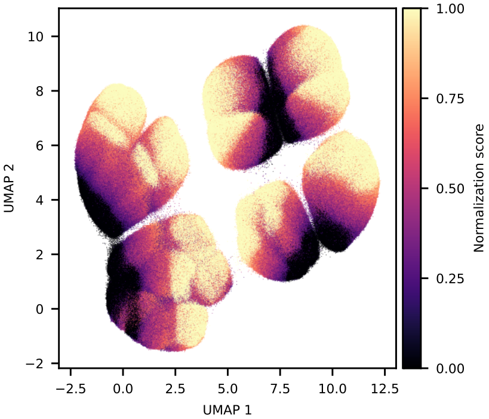

# m6anormalization

This repository provides a package for calculating k-mer normalization
constants for m6a levels inferred from DNA Nanopore reads. For more
detailed information, refer to the pulication:

[Simultaneous Profiling of Chromatin Accessibility and DNA Methylation
in Complete Plant Genomes Using Long-Read
Sequencing](https://www.biorxiv.org/content/10.1101/2023.11.15.567180v2).

<figure>
  <p align="center">
  
  </p>
</figure>

## Requirements

Before installation, ensure you have Python 3.x and Conda installed on your system. The package installation will automatically manage Pip and Numpy dependencies.

## Installation


### Create conda environment

It is highly recommendable to create a dedicated Conda environment.

```shell
conda create -n m6a python=3.6
conda activate m6a
```

### Install pip

If [pip](https://pypi.org/project/pip/) is not already installed, use
the following command

```shell
conda install pip
```

### Clone the repository and install the package

```shell
git clone https://github.com/aedera/m6anormalization
cd m6anormalization
pip install .
```

## Usage

### Process m6a calls

To process m6A calls from Nanopore reads, use the
[megalodon](https://github.com/nanoporetech/megalodon) tool. The
output file per_read_modified_base_calls.txt is required for
generating k-mer normalization constants. Execute the following
commands to process it before constant calculation:

```shell
awk '$7=="Y" {if(exp($5)>=0.75) { print $2"\t"$4"\t"$4"\t"1"\t"$3} else if(exp($5)<0.75) print $2"\t"$4"\t"$4"\t"0"\t"$3}' per_read_modified_base_calls.txt >  bper_read.tmp
sort -k 1,1 -k2,2n -T bper_read.tmp > bper_read.sorted.tmp
bedtools merge -i bper_read.sorted.tmp -c 4,4,5 -o count,mean,distinct -d -2 | \
awk '{if($3==$2) { print $1"\t"$2"\t"$3+1"\t"$5"\t"$6} else print  $1"\t"$2+1"\t"$2+2"\t"$5"\t"$6}' > m6a.bed
```

These commands discretize per-read m6A calls and aggregates them to
derive methylation levels per genomic adenine. These methylation
levels are stored in the `m6a.bed` file. Per-read m6a calls are
discretized using 0.75 as a threshold.

The `m6a.bed` file should look like this

```
Chr1    32      33      0.100   -       20
Chr1    34      35      0.071   +       14
Chr1    35      36      0.067   +       15
Chr1    36      37      0.174   -       23
Chr1    39      40      0.125   -       24
Chr1    40      41      0.083   -       24
Chr1    41      42      0.000   +       16
Chr1    42      43      0.000   +       17
Chr1    43      44      0.125   -       24
Chr1    47      48      0.083   -       24
Chr1    48      49      0.000   +       18
Chr1    49      50      0.000   +       18
Chr1    50      51      0.000   +       18
```

where the columns indicate 

|chromosome|start|end|m6a level|strand|coverage|
|----------|-----|---|---------|------|--------|


### Generate k-mer normalization constants

Use the `m6a.bed` file to generate k-mer normalization constants:

```shell
m6anormalization generate --bed m6a.bed \
                          --fas fas_file \
			  --chrs Chr1,Chr2,Chr3,Chr4,Chr5 \
			  --out kconstants.tsv
```

`fas_file` refers to the fasta file used as input for megalodon. The k-mers are extracted from the chromosomes indicated in `--chrs`.

### Apply normalization constants to genome

Apply the generated normalization constants (`kconstants.tsv`) to
normalize the m6a levels:

```shell
m6anormalization apply --norm kconstants.tsv \
                       --fas fas_file \
                       --bed m6a.bed
		       --chrs Chr1,Chr2,Chr3,Chr4,Chr5
```

This step produces a bed file per chromosome with normalized m6a
levels with the following format:

|chromosome|start|end|m6a level|strand|coverage|k-mer|normalized m6a level|
|----------|-----|---|---------|------|--------|-----|--------------------|

## Contributing

Contributions from anyone are welcome. You can start by adding a new entry [here](https://github.com/aedera/m6anormalization/issues).


## License

This package is released under the [MIT License](LICENSE).